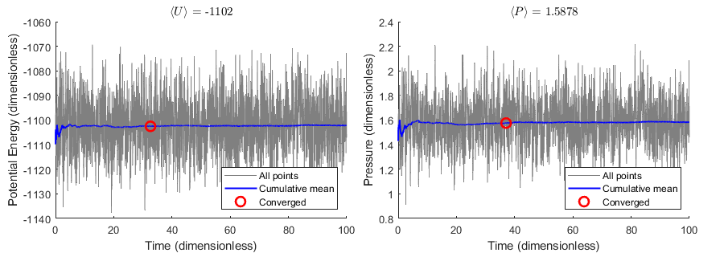
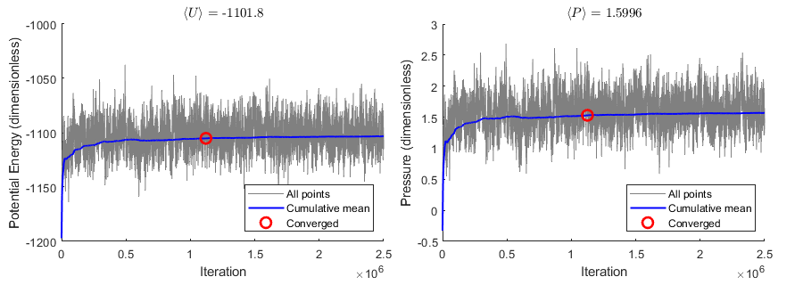

# Molecular Simulation of Materials: <br/> Basic Molecular Dynamics and Monte Carlo Simulations


## Project Description
Molecular simulation code written from scratch in C as coursework for [24-623: Molecular Simulation of Materials](https://www.meche.engineering.cmu.edu/education/courses/24-623.html).

Provides functionality for running MD simulations, complete with multiple thermodynamic ensembles, user-definable potentials, material property logging, particle trajectory output, and more. MC simulation is also included. A more comprehensive list of features is below.


The units for all quantities are dimensionless "Lennard-Jones" units, each derived in terms of the base units of length, mass, and energy. [HOOMD-Blue's documentation](https://hoomd-blue.readthedocs.io/en/stable/units.html) has some examples of this.

---

## Demonstration
Simulating 256 particles (argon) at 100K.

### Molecular Dynamics
MD simulations output a trajectory animation file and a log of material properties.

<p align="center"></p>
<p align="center">Visualization made using <a href="https://www.ovito.org/">OVITO</a>.</p>

Plotting potential energy and pressure of the system over time:
<p align="center"></p>

### Monte Carlo
Simulating the same material using MC, we get the same results:
<p align="center"></p>

---

## Features

#### Simulation
- NVE (microcanonical) Molecular Dynamics simulations with Velocity-Verlet integration
- NVT (canonical) Molecular Dynamics simulations using the Nos&#x00E9;-Hoover thermostat
- Markov Chain Monte Carlo simulations using the [Rosenbluth-Metropolis-Hastings Algorithm](https://en.wikipedia.org/wiki/Metropolis%E2%80%93Hastings_algorithm)

#### Measurements
- Measure the following properties of the system instantaneously:
  - Temperature and pressure
  - Kinetic energy, potential energy, and Hamiltonian
  - Mean squared displacement (MSD)
  - x-, y-, and z-components of momentum and center of mass

#### File I/O
- Read particle locations from a .txt file
- Output a text file log of material properties over time during a simulation
- Output particle locations as a .xyz or .pdb file
- Output particle trajectories as a .xyz animation file


#### Potentials
- Lennard-Jones potential with variable $\ \varepsilon $ and $\ \sigma $
- Harmonic bond (bonding is unfinished)
- Potentials from user-specified functions


#### Other features
- Built-in shifting cutoff radius support for potentials
- Periodic boundary conditions (with distinct xyz-components)
- Randomize particle velocities to match a target value
- Set the number density of the system
- Particles can have non-uniform mass
- Basic live system rendering on the terminal during a simulation

---

## Usage
Put main simulation code in `src/main.c`.  
To compile, use:
```
gcc src/*.c -o bin/simulate -lm
```
And then run with:
```
./bin/simulate
```

---

## Examples

The following are examples of how common routines can be implemented. 

### MD Simulation
This snippet demonstrates how to create an MD simulation in the NVT ensemble. To measure properties, it is recommended to let the system equilibrate in NVT, then turn off the thermostat to run in NVE, and log system properties there, as seen in this example.
```
MDSystem sys;                            // Create system
sys_init(&sys);                          // Initialize system with default Lennard-Jones potential

io_load_txt(&sys, "liquid256.txt");      // Load particles locations from file "liquid256.txt"
sys_set_boxlen(&sys, 6.8);               // Periodic boundary with box side lengths 6.8

anim_init(&sys, 100, "trajectory.xyz");  // Output locations to "trajectory.xyz" every 100 steps
log_init(&sys, 10, "log.txt");           // Output material properties to "log.txt" every 10 steps

sys_random_velocities(&sys, 1.773);      // Randomize particle speeds to about 1.773 on average 
                                         // (but keep zero overall momentum)

sys_set_dt(&sys, 0.002);                 // Set time step to 0.002 time units
sys_nvt_ensemble(&sys, temp, 0.05);      // Set system ensemble to NVT with tau = 0.05 time units
sys_run(&sys, 50000, 50);                // Run NVT 50,000 steps; print progress every 50 steps

sys_zero_trupos(&sys);                   // Reset mean-squared-displacement particle locations
sys_nve_ensemble(&sys);                  // Set system ensemble to NVE
sys_run(&sys, 50000, 50);                // Run NVE 50,000 steps; print progress every 50 steps

sys_destroy(&sys);                       // Free the system and close log/trajectory files
```

The function [`md_simulation()`](src/utils.c) does all of this in one step.

### MC Simulation
This example shows a basic MC simulation.
```
MDSystem sys;                          // Create system
sys_init(&sys);                        // Initialize system with default LJ potential

io_load_txt(&sys,"liquid256.txt");     // Load particles locations from file "liquid256.txt"
sys_set_boxlen(&sys, 6.8);             // Periodic boundary with box side lengths 6.8
log_init(&sys, 1, "log.txt");          // Output material properties to "log.txt" every 1 step

sys_run_mc(&sys,                       // Run a Monte Carlo simulation...
           0.831716,                   //   Dimensionless temperature:  kT = 0.831716
           0.1,                        //   Max particle perturbation:  dr = 0.1
           2.5e6,                      //   2,500,000 steps
           0);                         //   0 --> Do not print progress
                                            
io_export_xyz(&sys, "snapshot.xyz");   // Output final particle locations
sys_destroy(&sys);                     // Free the system and close log file
```

The function [`mc_simulation()`](src/utils.c) does all of this in one step.

### Custom Potential
This example demonstrates how to create a user-defined pair potential and apply it to a system. Consider a [Morse potential](https://en.wikipedia.org/wiki/Morse_potential) given by:  

$ U(r) = D_e \left(1 - e^{-a(r - r_{e})} \right)^2, $  

where $r$ is center-to-center distance, $D_e$ is well depth, $a$ describes well width, and $r_e$ is equilibrium distance. First, we define an energy function and a force function, both in the form `double potential_function(double r, double* params)`, with free parameters (in this case $D_e$, $a$, and $r_e$) in the `params` array:

```
double U_morse(double r, double* params) {
    double De = params[0];   // Well depth
    double a = params[1];    // Well width
    double r_eq = params[2]; // Equilibrium bond distance
    double part = 1 - exp(a * (r_eq - r));
    return De * part * part;
}

double F_morse(double r, double* params) {
    double De = params[0];   // Well depth
    double a = params[1];    // Well width
    double r_eq = params[2]; // Equilibrium bond distance
    double part = exp(a * (r_eq - r));
    return -2 * a * De * part * (1 - part);
}
```

Then, the potential can be applied to each particle pair in a system:

```
MDSystem sys;                      // Create system
sys_init(&sys);                    // Initialize system 
                                   // (with default LJ potential)

Potential morse;                   // Create a new potential
potential_init(&morse,             // Assign the potential:
               2.5,                // - Cutoff radius: 2.5
               &U_morse, &F_morse, // - Energy and Force functions
  (double[3])  {1, 4, 1.1});       // - Morse params: De, a, r_eq

sys.potential = &morse;            // Apply our new Morse potential
                                   // to each pair in the system

/* Export [r, U, F] table to potential.log */
check_potential(&sys, "potential.log");
```