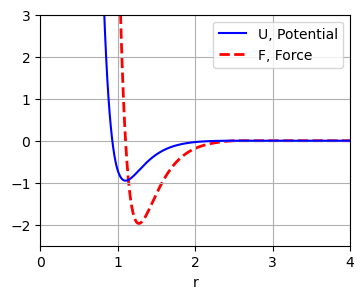
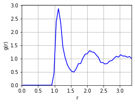

# Molecular Simulation of Materials: <br/> Basic Molecular Dynamics and Monte Carlo Simulations


## Project Description
Molecular simulation code written from scratch in C as coursework for [24-623: Molecular Simulation of Materials](https://www.meche.engineering.cmu.edu/education/courses/24-623.html).

Provides functionality for running MD simulations, complete with material property logging, user-definable potentials, multiple thermodynamic ensembles, particle trajectory output, radial distribution function calculation, and more. MC simulation is also included. A more comprehensive list of features is below.

---

## Demonstration
Simulating 256 particles (argon) at 100K. 

The units for all reported quantities are dimensionless units, each derived in terms of the base units of length, mass, and energy. [HOOMD-Blue's documentation](https://hoomd-blue.readthedocs.io/en/stable/units.html) has some examples of this.

### Molecular Dynamics
MD simulations output a trajectory animation file and a log of material properties. This particular simulation runs in the NVT ensemble for 50,000 time steps of size 0.002. Then the ensemble is changed to NVE, and it runs for another 50,000 steps.

<p align="center"></p>
<p align="center">Visualization made using <a href="https://www.ovito.org/">OVITO</a>.</p>

Plotting potential energy and pressure of the system over the last 100 dimensionless time units:
<p align="center"></p>

### Monte Carlo
Simulating the same material using MC for 2.5 million iterations, we get the same results:
<p align="center"></p>

---

## Features

#### Simulation
- NVE (microcanonical ensemble) Molecular Dynamics simulations via Velocity-Verlet integration
- NVT (canonical ensemble) Molecular Dynamics simulations using the Nos&#x00E9;-Hoover thermostat
- Markov Chain Monte Carlo simulations with the [Rosenbluth-Metropolis-Hastings Algorithm](https://en.wikipedia.org/wiki/Metropolis%E2%80%93Hastings_algorithm)

#### Measurements
- Measure the following properties of the system instantaneously:
  - Temperature and pressure
  - Kinetic energy, potential energy, and Hamiltonian
  - Mean squared displacement (MSD)
  - x-, y-, and z-components of momentum and center of mass
  - Radial distribution function

#### File I/O
- Read particle locations from a .txt file
- Output a text file log of material properties over time during a simulation
- Output particle locations as a .xyz or .pdb file
- Output particle trajectories as a .xyz animation file
- Export radial distribution function, g(r), to a text file

#### Potentials
- Built-in pair potentials with variable parameters
  - Lennard-Jones potential
  - Morse potential
  - Harmonic bond (bond support is unfinished)
- Potentials from user-specified functions
- Built-in shifting cutoff radius support for potentials

#### Other features
- Periodic boundary conditions (with distinct xyz-components)
- Randomize particle velocities to match a target value
- Set the number density of the system
- Particles can have non-uniform mass
- Basic live system rendering on the terminal during a simulation

---

## Usage
Include the header file `md_all.h`. Put main simulation code in `src/main.c`.  
To compile, use:
```
gcc src/*.c -o bin/simulate -lm
```
And then run with:
```
./bin/simulate
```

---

## Examples

The following are examples of how common routines can be implemented. These are all found in [examples/](examples/).

### MD Simulation
This snippet demonstrates how to create an MD simulation in the NVT ensemble. To measure properties, it is recommended to let the system equilibrate in NVT, then turn off the thermostat to run in NVE, and log system properties there, as seen in this example.
```C
MDSystem sys;                            // Create system
sys_init(&sys);                          // Initialize system with default Lennard-Jones potential

io_load_txt(&sys, "liquid256.txt");      // Load particle locations from file "liquid256.txt"
sys_set_boxlen(&sys, 6.8);               // Periodic boundary with box side lengths 6.8

anim_init(&sys, 100, "trajectory.xyz");  // Output locations to "trajectory.xyz" every 100 steps
log_init(&sys, 10, "log.txt");           // Output material properties to "log.txt" every 10 steps

sys_random_velocities(&sys, 1.773);      // Randomize particle speeds to about 1.773 on average 
                                         // (but keep zero overall momentum)

sys_set_dt(&sys, 0.002);                 // Set time step to 0.002 time units
sys_nvt_ensemble(&sys, temp, 0.05);      // Set system ensemble to NVT with tau = 0.05 time units
sys_run(&sys, 50000, 50);                // Run NVT 50,000 steps; print progress every 50 steps

sys_zero_trupos(&sys);                   // Reset mean-squared-displacement particle locations
sys_nve_ensemble(&sys);                  // Set system ensemble to NVE
sys_run(&sys, 50000, 50);                // Run NVE 50,000 steps; print progress every 50 steps

sys_destroy(&sys);                       // Free the system and close log/trajectory files
```

The function [`md_simulation()`](src/utils.c) does all of this in one step.

### MC Simulation
This example shows a basic MC simulation.
```C
MDSystem sys;                          // Create system
sys_init(&sys);                        // Initialize system with default LJ potential

io_load_txt(&sys,"liquid256.txt");     // Load particle locations from file "liquid256.txt"
sys_set_boxlen(&sys, 6.8);             // Periodic boundary with box side lengths 6.8
log_init(&sys, 1, "log.txt");          // Output material properties to "log.txt" every 1 step

sys_run_mc(&sys,                       // Run a Monte Carlo simulation...
           0.831716,                   //   Dimensionless temperature:  kT = 0.831716
           0.1,                        //   Max particle perturbation:  dr = 0.1
           2.5e6,                      //   2,500,000 steps
           0);                         //   0 --> Do not print progress
                                            
io_export_xyz(&sys, "snapshot.xyz");   // Output final particle locations
sys_destroy(&sys);                     // Free the system and close log file
```

The function [`mc_simulation()`](src/utils.c) does all of this in one step.

### Custom Potential
This example demonstrates how to create a user-defined pair potential and apply it to a system. Consider a [Morse potential](https://en.wikipedia.org/wiki/Morse_potential) given by:  

$$ U(r) = D_e \left(1 - e^{-a(r - r_{e})} \right)^2, $$

where $r$ is center-to-center distance, $D_e$ is well depth, $a$ describes well width, and $r_e$ is equilibrium distance. First, we define a struct that contains the necessary parameters. 

```C
typedef struct MorseParameters {
    double D_e; // Well depth
    double   a; // Well width (larger a = wider well)
    double r_e; // Equilibrium distance
} MorseParameters;
```

Then, we define an energy function and a force function, each in the form `double potential_function(double r, const void* params)`, with free parameters (in this case $D_e$, $a$, and $r_e$) accessed by casting the `params` void pointer into a pointer to the struct of parameters.

```C
double U_morse(double r, const void* params) {
    const MorseParameters* P = (const MorseParameters*) params;
    double part = 1 - exp(P->a * (P->r_e - r));
    return P->D_e * part * part;
}
double F_morse(double r, const void* params) {
    const MorseParameters* P = (const MorseParameters*) params;
    double part = exp(P->a * (P->r_e - r));
    return -2 * P->a * P->D_e * part * (1 - part);
}
```

Then, the potential can be applied to each particle pair in a system. This code sets up the custom potential, and then prints a table of distance, potential energy, and force information to a file.

```C
MDSystem sys;                       // Create system
sys_init(&sys);                     // Initialize system 
                                    // (with default LJ potential)
MorseParameters params = {          // Define Morse parameters
    .D_e = 1, .a = 4, .r_e = 1.1
};
Potential morse;                    // Create a new potential
potential_init(&morse,              // Assign the potential:
               2.5,                 // - Cutoff radius: 2.5
               &U_morse, &F_morse,  // - Energy and Force functions
               &params);            // - Morse params: D_e, a, r_e

sys.potential = &morse;             // Apply our new Morse potential
                                    // to each pair in the system

/* Export [r, U, F] table to potential.log */
check_potential(&sys, "potential.log");
```

[Plotting](scripts/plot_potential.py) the exported results, we see that the custom Morse potential has been implemented correctly:

<p align="center"></p>

### Radial Distribution Function

$g(r)$, the Radial Distribution Function (RDF) of a system describes the density of particles at a distance $r$ from each particle. The functions `rdf_export_from_system` and `rdf_export_from_system` can be used to compute/export the radial distribution function of a system at a given instant. The number of histogram bins must be specified. Ideally, the instantaneous RDF should be averaged across several time steps to give a smoother function.

```C
MDSystem sys;                          // Create system
sys_init(&sys);                        // Initialize system with default LJ potential

io_load_txt(&sys,"liquid256.txt");     // Load particle locations from file "liquid256.txt"
sys_set_boxlen(&sys, 6.8);             // Periodic boundary with box side lengths 6.8

/* Run simulation here */

rdf_export_from_system(&sys,           // Print g(r) for a system
                       50,             // 50 bins
                       "rdf.txt");     // Print r and g(r) to "rdf.txt"

sys_destroy(&sys);                     // Free the system and close log file
```

From the contents of the output file "rdf.txt", we can create the following [RDF plot](scripts/plot_rdf.py):
<p align="center"></p>
